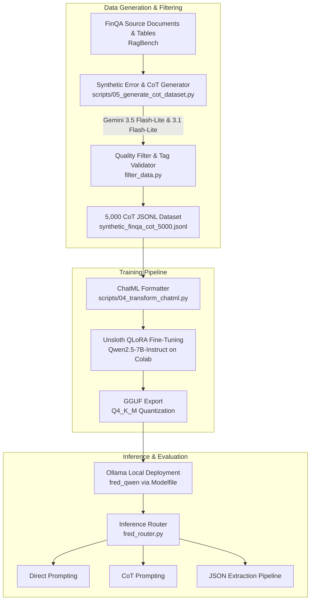

# FRED — Financial Retrieval-Enhanced Detection & Editing of Hallucinations

[](https://www.python.org/)
[](synthetic_finqa_cot_5000.jsonl)
[](https://huggingface.co/Qwen/Qwen2.5-7B-Instruct)
[](https://github.com/unslothai/unsloth)
[-black.svg)](https://ollama.com/)
[](#-academic-course-project-context)

> **FRED** (**F**inancial **R**etrieval-**E**nhanced **D**etection and **E**diting) is a specialized framework designed to detect, reason over, and surgically correct factual and numerical hallucinations in financial question-answering outputs.
>
> Operating over financial tabular contexts (such as earnings reports, 10-Ks, and SEC filings from **FinQA** and **TAT-QA**), FRED combines step-by-step **Chain-of-Thought (CoT)** mathematical auditing with **in-place XML semantic tag edits** (`<numerical><delete>...</delete><mark>...</mark></numerical>`).

---

## 🎓 Academic Course Project Context

This repository is a **small-scale academic replication and extension** developed for an academic graduate/course project.

### Original Research Paper Reference
- **Title**: *FRED: Financial Retrieval-Enhanced Detection and Editing of Hallucinations in Language Models*
- **Authors**: Likun Tan\*, Kuan-Wei Huang\*, Kevin Wu (University of Michigan / Pegasi AI)
- **Local PDF Reference**: [`LLM FRED.pdf`](file:///c:/Users/Akash/Desktop/FRED/LLM%20FRED.pdf)
- **Original Research Codebase**: [pegasi-ai/shie](https://github.com/pegasi-ai/shie)

### Replication vs. Original Paper: Design Adaptations

| Aspect | Original Paper | Our Academic Replication |
|---|---|---|
| **Goal** | Enterprise-scale hallucination detection across multiple domains | Feasibility, auditable mathematical reasoning, and localized edge deployment |
| **Compute Environment** | Multi-GPU enterprise cluster (A100/H100) | Single-GPU academic environment (Google Colab T4/V100 + Unsloth) |
| **Base Models** | Phi-4, Phi-4-mini, Qwen3-4B, Qwen3-14B | **Qwen2.5-7B-Instruct** (efficient 4-bit QLoRA) |
| **Dataset Scale** | Multi-dataset corpus (FinQA, TAT-QA, FAVA) | **5,000 synthetic FinQA CoT samples** (`synthetic_finqa_cot_5000.jsonl`) from `rungalileo/ragbench` |
| **CoT Reasoning** | Direct XML editing (often zero-shot / few-shot tag insertion) | **Extended with explicit Chain-of-Thought**: Auditable mathematical verification (`Reasoning: ... Correction: ...`) |
| **Deployment** | Server-side API endpoints | **Zero-cloud local inference via Ollama** (`Qwen2.5-7B-Instruct.Q4_K_M.gguf` + custom `Modelfile`) |
| **Inference Exploration** | Direct prompt evaluation | Multi-strategy evaluation (**Direct**, **CoT**, and structured **JSON pipeline**) via [`fred_router.py`](file:///c:/Users/Akash/Desktop/FRED/fred_router.py) |
| **Cost & Accessibility** | High compute budget | **$0 cloud cost** — built entirely with free-tier Google AI Studio API keys, Colab, and local open-source tools |

---

## 🚀 Key Highlights & Synthetic CoT Dataset

### 5,000 High-Fidelity Synthetic CoT Samples (`synthetic_finqa_cot_5000.jsonl`)
The dataset was generated using a high-throughput multi-key sequential pipeline over FinQA source documents.

> **Generation Architecture & Dual-Model Strategy:**
> To maximize reasoning depth while operating within Google AI Studio quota allocations, generation was powered sequentially by **two models**:
> 1. **`gemini-3.5-flash-lite`**: Leveraged for bulk high-fidelity reasoning across initial and intermediate batches (~4,300+ samples).
> 2. **`gemini-3.1-flash-lite`**: Deployed across multi-key rotations (`Key 1`, `Key 2`, and `Key 3`) for resilient throughput and completing the final sprint to reach the exact 5,000-sample milestone.
> 
> Strict rate-limiting of **4.5 seconds per request (13.3 RPM)** was enforced throughout to ensure strict compliance with Google AI Studio's 15 RPM free-tier threshold with zero request drops or quota failures.

### Dataset Schema
Each line in [`synthetic_finqa_cot_5000.jsonl`](synthetic_finqa_cot_5000.jsonl) is a valid, validated JSON record:
```json
{
  "context": "[Doc 1] ... [Doc 2] [[Table data ...]]",
  "question": "what was the net profit margin on december 31 2013",
  "response": "The net income for December 31, 2013, was $2707 million and the revenue was $40782 million. Calculating the net profit margin (Net Income / Revenue * 100), we get ($2707 / $40782) * 100, which equals 8.2%.",
  "target_output": "Reasoning: First, identify the correct data from the context: Net Income is $2707 million and Revenue is $40782 million. The formula for net profit margin is (Net Income / Revenue) * 100. Calculating this gives ($2707 / $40782) * 100 = 6.6377..., which rounds to 6.6%. The model's response of 8.2% is mathematically incorrect. Correction: The net income for December 31, 2013, was $2707 million and the revenue was $40782 million. Calculating the net profit margin (Net Income / Revenue * 100), we get ($2707 / $40782) * 100, which equals <numerical><delete>8.2%</delete><mark>6.6%</mark></numerical>."
}
```

---

## 🧠 System Architecture & Methodology



### Core Innovations in This Course Project
1. **Auditable Chain-of-Thought Prior to Tagging**: In financial contexts, black-box edits are untrustworthy. Enforcing `Reasoning: ...` before `Correction: ...` ensures every calculation (sums, percentage changes, ratios) can be verified by human auditors.
2. **Tag-Based In-Place Correction**: Rather than regenerating the whole answer from scratch, FRED learns targeted replacements: `<category><delete>erroneous_text</delete><mark>corrected_text</mark></category>`.
3. **Addressing Distribution Shift**: In our inference tests, models trained without CoT dropped XML tags when prompted with CoT. Our 5,000 CoT dataset directly teaches the model to perform both reasoning and XML tag formatting in a unified forward pass.
4. **Local Privacy-Preserving Inference**: Financial data is sensitive. By exporting to GGUF and deploying through Ollama, the fine-tuned editor runs 100% offline on a workstation.

---

## 📁 Repository Structure

```
FRED/
├── .env.example                     ← Template for API keys (never commit secrets)
├── .gitignore                       ← Git ignore rules (ignores .env and .gguf binaries)
├── LLM FRED.pdf                     ← The original research paper by Tan et al.
├── PROJECT_STATE.md                 ← Comprehensive project milestones & state tracker
├── README.md                        ← Main documentation (this file)
├── Modelfile (1)                    ← Ollama Modelfile configuration for fred_qwen
├── config.py                        ← Central configuration parameters
├── filter_data.py                   ← Data quality validation & sanity checks
├── fred_router.py                   ← Multi-strategy inference router (Direct, CoT, Pipeline)
├── groq_utils.py                    ← Alternative LLM utilities
│
├── notebooks/
│   ├── 01_inspect_datasets.ipynb    ← Exploratory inspection of FinQA & TAT-QA
│   └── 02_error_insertion_finqa.ipynb← Error insertion & hallucination prototyping
│
├── scripts/
│   ├── 02_generate_dataset.py       ← Initial dataset generator (1,500 samples)
│   ├── 03_generate_dataset_gemini.py← Gemini API generator
│   ├── 04_transform_chatml.py       ← Pipeline to convert JSONL into Unsloth ChatML format
│   └── 05_generate_cot_dataset.py   ← Dual-model, multi-key 5,000 CoT generator
│
├── synthetic_finqa_1500.jsonl       ← Baseline 1,500 non-CoT synthetic dataset
├── chatml_finqa_1500.jsonl          ← Baseline 1,500 ChatML dataset
└── synthetic_finqa_cot_5000.jsonl   ← Complete 5,000 sample CoT dataset (Gemini 3.5 & 3.1)
```

---

## 🛠️ Quickstart Guide

### 1. Prerequisites & Installation

Clone the repository and install dependencies:
```bash
git clone https://github.com/Akash-Purbhi/FRED-Financial-Retrieval-Enhanced-Detection-and-Editing-of-Hallucinations-in-Language-Models.git
cd FRED
pip install -r requirements.txt
```
*(Key dependencies: `google-generativeai`, `datasets`, `python-dotenv`, `requests`, `unsloth`, `tqdm`)*

### 2. Configure Environment Keys

Create a `.env` file in the root directory:
```env
GEMINI_API_KEY="your_primary_key"
GEMINI_API_KEY_2="your_secondary_key"
GEMINI_API_KEY_3="your_tertiary_key"
```

### 3. Generate or Resume Dataset Generation
Run the dual-model generator (auto-resumes from existing rows):
```bash
python scripts/05_generate_cot_dataset.py
```

### 4. Transform into ChatML Format for Fine-Tuning
Prepare the dataset for Unsloth training:
```bash
python scripts/04_transform_chatml.py
```

### 5. Deploy with Ollama Locally
Create and run the model in Ollama:
```bash
ollama create fred_qwen -f "Modelfile (1)"
ollama run fred_qwen
```

---

## 📊 Milestone Tracker

| # | Milestone | Status | Output / Artifact |
|---|---|---|---|
| 1 | Load & inspect FinQA + TAT-QA from RagBench | ✅ Done | `notebooks/01_inspect_datasets.ipynb` |
| 2 | Prototype error insertion & tagging logic | ✅ Done | `notebooks/02_error_insertion_finqa.ipynb` |
| 3 | Bulk generate 1,500 synthetic samples | ✅ Done | `synthetic_finqa_1500.jsonl` |
| 4 | Transform dataset into ChatML format | ✅ Done | `chatml_finqa_1500.jsonl` |
| 5 | Phase 1 Fine-Tuning (QLoRA 2 epochs) | ✅ Done | Unsloth QLoRA on Google Colab |
| 6 | GGUF Quantization & Ollama Deployment | ✅ Done | `Qwen2.5-7B-Instruct.Q4_K_M.gguf` |
| 7 | Inference Router & Prompt Strategy Evaluation | ✅ Done | `fred_router.py` |
| 8 | **Bulk generate 5,000 CoT samples (Gemini 3.5 & 3.1)** | ✅ **Done** | `synthetic_finqa_cot_5000.jsonl` |
| 9 | Phase 2 Retraining with CoT (3–4 epochs) | ⬜ Planned | Google Colab / Unsloth |
| 10 | Post-Fine-Tune Evaluation & Benchmark | ⬜ Planned | FinQA Test Split |

---

## 📜 Acknowledgements & Citation

This academic project replicates and builds upon the foundational research presented in:
```bibtex
@article{tan2024fred,
  title={FRED: Financial Retrieval-Enhanced Detection and Editing of Hallucinations in Language Models},
  author={Tan, Likun and Huang, Kuan-Wei and Wu, Kevin},
  journal={arXiv preprint},
  year={2024}
}
```
We also thank the creators of [RagBench](https://github.com/rungalileo/ragbench), [Unsloth](https://github.com/unslothai/unsloth), and [Ollama](https://ollama.com/) for open-sourcing essential tools enabling reproducible academic AI research.

---

## 📜 License
This project is open-source under the Apache 2.0 / MIT License.
